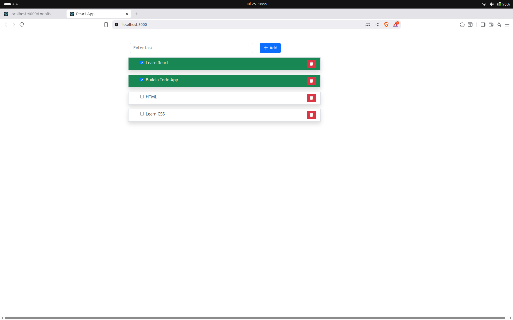

# React To-Do List App

A simple and intuitive To-Do List application built with React. Easily manage your daily tasks, mark them as complete, and stay organized!

## Features

- **Add Tasks:** Quickly add new tasks to your to-do list.
- **Delete Tasks:** Remove tasks you no longer need.
- **Mark as Complete:** Check off tasks when they're done.
- **Persistent Storage:** Tasks are saved in your browser's local storage.

## Getting Started


### Prerequisites

- [Node.js](https://nodejs.org/) and npm installed on your machine.

### Installation

1. Clone the repository:
    ```bash
    git clone https://github.com/your-username/todo_list_app.git
    cd todo_list_app
    ```
2. Install dependencies:
    ```bash
    npm install
    ```

### Run the json server

Start run the command to run the json server from the file of data.json
```bash
sudo npx json-server -p 4000 -w src/data/db.json
```

Different port number can use instead of 4000 .
If you change port please change the port number in the file of src/api/apiResource.js of url's port.
open [http://localhost:4000/todolist](http://localhost:4000/todolist) in your browser to view the running api server
### Running the App

Start the development server:
```bash
npm start
```
Open [http://localhost:3000](http://localhost:3000) in your browser to view the app.

### Building for Production

To create an optimized production build:
```bash
npm run build
```

## Usage

1. Enter a task in the input field and click "Add" to create a new to-do.
2. Click the checkbox to mark a task as complete.
3. Use the delete buttons to remove tasks.
4. View all task, active, or completed tasks.

## Contributing

Pull requests are welcome! For major changes, please open an issue first to discuss what you would like to change.

## License

[MIT](LICENSE)

---

Made with ❤️ using